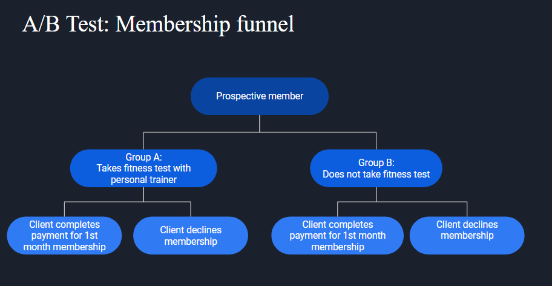
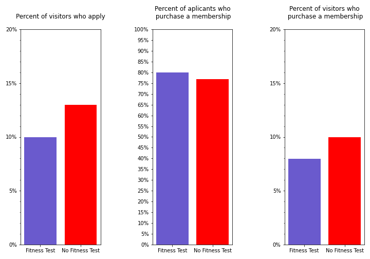

# MuscleHub-A-B-Testing
business analysis of gym's acquisition funnel

## Project Overview
The purpose of this analysis was to determine whether potential gym members were more likely to purchase a membership based on whether or not they were given an entrance fitness consultation exam with a personal trainer. In this setup, group A followed the normal acquisition funnel and completed a fitness test, whereas group B skipped this test to proceed straight to membership application. 

In conclusion, the statistical analysis reveals there was no statistical significance between the percentage of applicants who decide to purchase a membership after completing the application. However, we failed to reject the null hypothesis in favor of evidence that suggests the percentage of new applicants is dependent on wehether or not they complete a fitness test prior!

Please see slide deck for complete analysis and source code.
